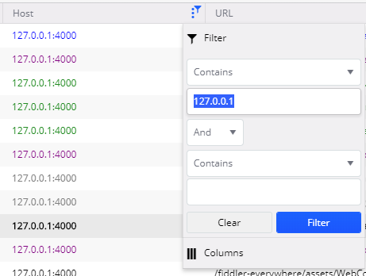

#### Environment

|   |   |
|---|---|
| Product  | Fiddler Everywhere  |
| Product Version | 1.0.0 and above  |

#### Description

Traffic sent to [http://localhost](http://localhost) or [http://127.0.0.1](http://127.0.0.1) is not captured when using some browsers like Google Chrome or Firefox (when Fiddler Everywhere capturing mode is turned on).

## Solution

There are two different solutions, both of which are resolving the described problem. The first one is to [use the machine name](#using-machine-name) instead of _localhost_, and the second one is to [use one of the specially provided aliases](#using-aliases) in Fiddler Everywhere. Note that both the aliases and the machine name replacement will work when Fiddler Everywhere client capturing mode is ON.

## Using Machine Name

Use the **machine name** as an alias for _localhost_ or _127.0.0.1_ loopback addresses.

For example, let's assume the machine name is _myrootuserid_
Instead of using _localhost_ like this:
```Shell
http://localhost:8081/mytestpage.aspx
```

**Use the machine name** as follows:
```Shell
http://myrootuserid:8081/mytestpage.aspx
```

## Using Aliases

Use a special Fiddler allias **ipv4.fiddler** (for connections using Internet Protocol version 4) or **ipv6.fiddler** (for connections using Internet Protocol version 6) or **localhost.fiddler** to hit _localhost_ in the _Host_ header (IIS Express).

Instead of using _localhost_ like this:
```Shell
http://localhost:8081/mytestpage.aspx
```

**Use the alias** as follows (to hit _localhost_ on **IPv4** adapter):
```Shell
http://ipv4.fiddler:8081/mytestpage.aspx
```

**or** (to hit _localhost_ on **IPv6** adapter)
```Shell
http://ipv6.fiddler:8081/mytestpage.aspx
```

**or** (to hit _localhost_ in the _Host_ header - applicable for ISS Express)
```Shell
http://ipv4.fiddler:8081/mytestpage.aspx
```

## Filter Localhost Traffic

While using one of the above solutions to capture localhost requests, the traffic will be captured in the Live Traffic list, and as host name, the loopback address will be displayed (usually **127.0.0.1**). To filter by the **Host** column so that only localhost traffic is displayed, you will need to enter the loopback address as host value and not the aliases used in the browsers.

